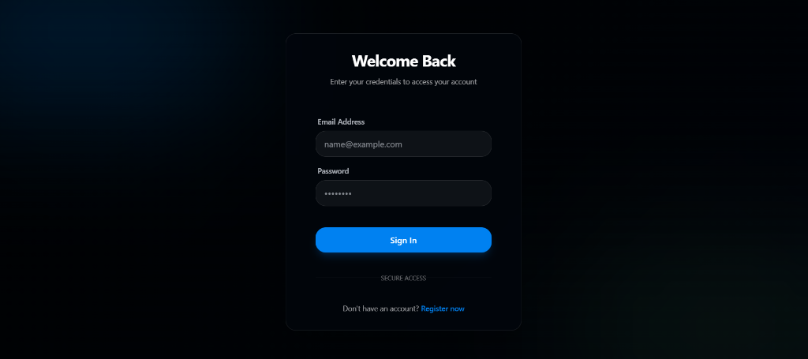
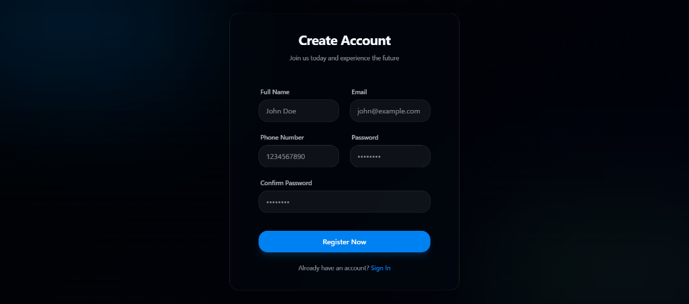

# 🌌 Stellar Auth

A premium, full-stack authentication system built with the MERN stack, featuring a modern glassmorphic UI, robust security, and standardized architectural patterns.

## ✨ Features

- **Modern UI/UX**: Stunning glassmorphic design with smooth entrance animations and micro-interactions.
- **Secure Authentication**: Password hashing using `bcryptjs` and standardized API endpoints.
- **Real-time Validation**: Comprehensive frontend and backend validation for email, phone number, and password.
- **Global Auth Store**: Context API integration for persistent user sessions across the app.
- **MERN Architecture**: Clean separation of concerns with models, controllers, and routes.
- **MongoDB Atlas**: Fully integrated with MongoDB Atlas for persistent data storage.

## 🚀 Tech Stack

### Frontend
- **React.js** (Vite)
- **Tailwind CSS** (Custom Glassmorphism)
- **shadcn/ui**
- **Context API**
- **Axios** (API requests)

### Backend
- **Node.js**
- **Express.js**
- **Mongoose** (MongoDB ODM)
- **dotenv** (Configuration)

---

## 🛠️ Getting Started

### Prerequisites
- Node.js (v18 or higher)
- MongoDB Atlas Account

### 1. Backend Setup
```bash
cd server
npm install
```
Create a `.env` file in the `server` directory using `.env.example` as reference:

```env
MONGODB_URI=your_mongodb_connection_string
PORT=5000
```
Start the development server:
```bash
npm run dev
```

### 2. Frontend Setup
```bash
cd client
npm install
npm run dev
```

---

## 📂 Project Structure

### Server
- `models/`: Database schemas (Mongoose).
- `controllers/`: Request handling logic.
- `routes/`: API endpoint definitions.
- `config/`: Configuration files (DB connection).

### Client
- `src/pages/`: Main application views (Login, Signup).
- `src/components/`: Reusable UI components.
- `src/context/`: Global state management.
- `src/services/`: API configuration.

---

## 🛡️ Security

- Passwords are never stored in plain text.
- Standardized CORS configuration for secure cross-origin requests.
- Sensitive credentials managed via environment variables.

---

## � Screenshots

### Login Page


### Signup Page


---

## �📄 License
This project is licensed under the MIT License.

